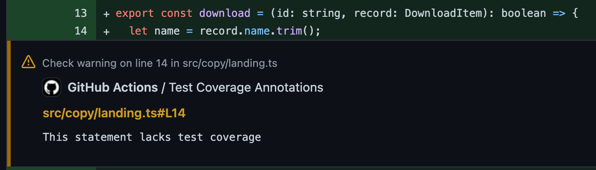

# Test Coverage Reporter

A github action that generates a comprehensive unit test coverage, including optional coverage diff with the branch the PR
will merge into.


## Usage

```
- name: Generate report
  uses: jgillick/test-coverage-reporter@v1
  with:
    coverage-file: coverage/coverage-final.json
    access-token: ${{ secrets.GITHUB_TOKEN }}
```

## Inputs

- `coverage-file`: Path to the test coverage report
- `base-coverage-file`: Path to the coverage report from the branch to compare against.
- `access-token`: Required to comment on the PR
- `fail-delta`: If coverage for any file is reduced by this much (in percent) the run will fail. (default: `0.2`)
- `title`: The coverage report title
- `custom-message`: Add this custom text to the output.
- `strip-path-prefix`: Remove this part of the path of the front of all file paths in the coverage report.

## Compare coverage with base

You can easily see how this PR will either add or remove coverage from the branch it will be merging into by passing the `base-coverage-file` input.

```
- name: Generate report
  uses: jgillick/test-coverage-reporter@v1
  with:
    coverage-file: coverage/coverage-final.json
    base-coverage-file: main-branch/coverage/coverage-final.json
    access-token: ${{ secrets.GITHUB_TOKEN }}
```

See a full example in this [repos workflow](./.github/workflows/test.yml).

For larger test suites, it can be more performant to save the base coverage to a longer-lived artifact and use an action like [actions-download-artifact](https://github.com/jgillick/actions-download-artifact) to download it.

## Also try

You might also like the [Test Coverage Annotations](https://github.com/marketplace/actions/test-coverage-annotations) action, which makes it easier to see which lines are lacking test coverage.



## Acknowledgements

This action was inspired by the work of [Jest coverage report](https://github.com/ArtiomTr/jest-coverage-report-action) and [Jest Coverage Reporter Action](https://github.com/adRise/jest-cov-reporter).
